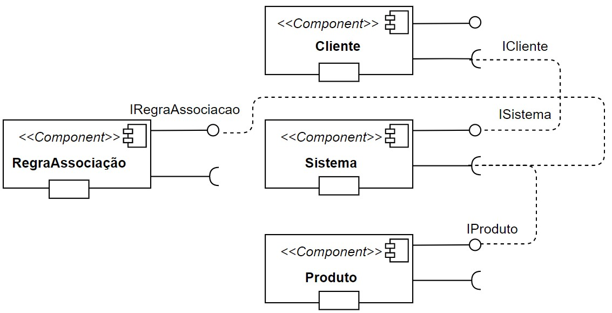
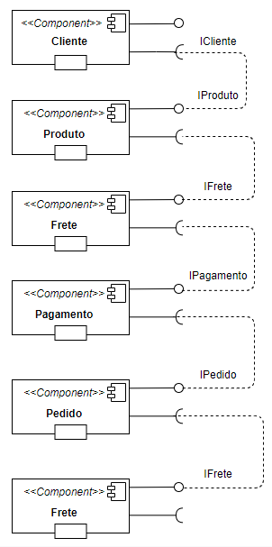
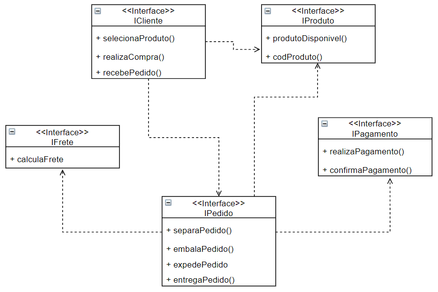

# INF331 - Componentes De Software
Matéria INF331 do curso de especialização de software da Unicamp

# Aluno
Andrew Guedes Siqueira - ex145126

# Data Flow, Componentes e Regras de Associação
*Lab de Componentização e Reúso de Software 07/08/2020*

---

## Tarefa: Projeto de Composição para Recomendação
* Imagem da tarefa: Projeto de Composição para Recomendação:  

---

## Tarefa: Projeto de Composição de Pedido  

* Imagem da tarefa: Projeto de Composição de Pedido Componentes:  

---

* Imagem da tarefa: Projeto de Composição de Pedido Interface:  

