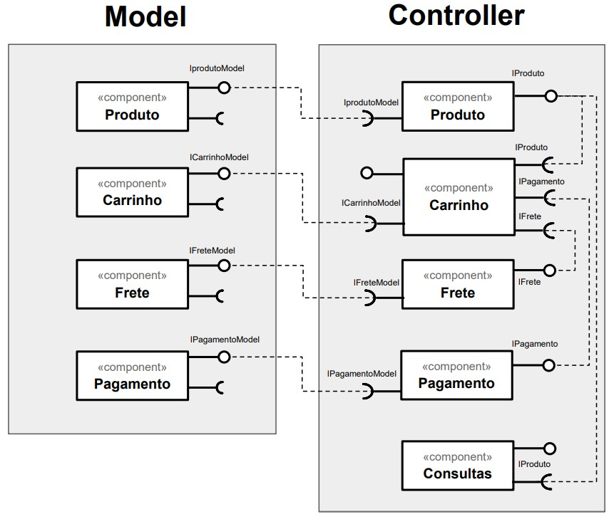

# Serviços
*Andrew Guedes Siqueira*

No link do Google Drive [modelo](https://docs.google.com/presentation/d/1ujoME3qoriVm7hHiC8uK2qWQ3mmHA81Qxe8n80vZYms/edit?usp=sharing) ou no diretório [resources/](resources/) você encontrará um modelo para resolver duas tarefas:

Para as Tarefas 1, 2 e 3 que estão listadas dentro dos slides:

## Tarefa 1
*Componentes de Negócio*

Delimite partes do diagrama à esquerda que você avalia que deveriam estar dentro de um componente.

### Arquivo Tarefa 1 - Componentes de Negócio
- 

## Tarefa 2
*Componentes Técnicos*

Separe os componentes do View daqueles definidos no Controller.

### Arquivo Tarefa 2 - Componentes Técnicos
- 

## Tarefa 3
*Componentes Técnicos*

Separe os componentes do Model daqueles definidos no Controller.

### Arquivo Tarefa 3 - Componentes Técnicos
- 

## Tarefa 4

Encontre dois serviços REST interessantes, que recebam no mínimo dois parâmetros e execute pelo menos uma consulta em cada um deles. Apresente para cada serviço que você escolheu:
* o título do serviço
* a URI do serviço
* uma breve descrição do mesmo
* o cabeçalho HTTP da requisição
* o cabeçalho e conteúdo JSON, XML ou outro formato da resposta

### Resposta Tarefa 4 - REST 1

### * o título do serviço
* Via CEP*
### * a URI do serviço
* https://viacep.com.br/ws/*
### * uma breve descrição do mesmo
* API pública para consulta de CEPs*
### * o cabeçalho HTTP da requisição
* header "Accept: application/json"*
### * o cabeçalho e conteúdo JSON, XML ou outro formato da resposta
- 

### Resposta Tarefa 4 - REST 2

### * o título do serviço
* InSight: Mars Weather Service API - Serviço meteorológico de Marte*
### * a URI do serviço
* https://api.nasa.gov/insight_weather/*
### * uma breve descrição do mesmo
* A sonda InSight Mars da NASA faz medições contínuas do clima (temperatura, vento, pressão) na superfície de Marte em Elysium Planitia, uma planície plana e lisa perto do equador de Marte. Última atualização em 28/08/2019.
 
URL: https://api.nasa.gov/*
### * o cabeçalho HTTP da requisição
* header
        "Accept: text/html,application/xhtml+xml,application/xml;q=0.9,image/webp,image/apng,*/*;q=0.8,application/signed-exchange;v=b3;q=0.9"
        "Accept-Encoding: gzip, deflate, br"
        "Accept-Language: pt-BR,pt;q=0.9,en-US;q=0.8,en;q=0.7,la;q=0.6"
        "Cache-Control: max-age=0"
        "Connection: keep-alive"
        "Cookie: _ga=GA1.3.216028416.1598585334; _gid=GA1.3.1002703816.1598585334"
        "Host: api.nasa.gov"
        "Sec-Fetch-Dest: document"
        "Sec-Fetch-Mode: navigate"
        "Sec-Fetch-Site: none"
        "Sec-Fetch-User: ?1"
        "Upgrade-Insecure-Requests: 1"
        "User-Agent: Mozilla/5.0 (Windows NT 10.0; Win64; x64) AppleWebKit/537.36 (KHTML, like Gecko) Chrome/84.0.4147.105 Safari/537.36" *
### * o cabeçalho e conteúdo JSON, XML ou outro formato da resposta
- 
